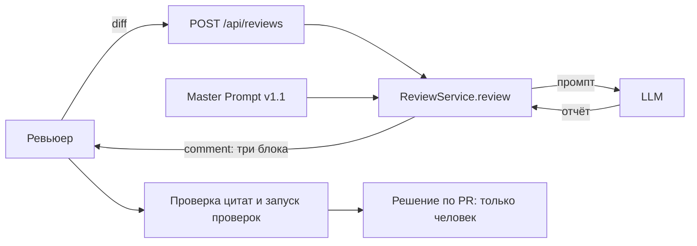

# ADR: помощник только читает diff и возвращает три блока

- Статус: proposed (принимаю я)
- Дата: 2026-09-20
- Ответственные: я (владелец решения)

## Контекст

Кейс: AI-помощник ревьюера PR ([`context.md`](context.md), [`problem.md`](problem.md)). По `TRAINING_PR.diff` добавляются `POST /api/reviews` (`create_review(payload: dict)` берёт `payload["diff"]`) и `ReviewService.review`, который подставляет diff в промпт и возвращает `{"comment": answer}`. Без требований к ответу модель отвечает длинно, без формата, с выдуманными строками (P1-01, подтверждено 3 из 10 пунктов, ещё 1 принят как гипотеза). С master prompt ответ структурирован и доказан цитатами, но остались гипотезы без пометки и расплывчатая проверка (P1-02). Реализация `LLM` и `app.dependencies` в diff неизвестна (допущение).

## Решение

1. Помощник только читает diff: не делает approve, merge, не меняет код, не предлагает патчи.
2. Ответ помощника состоит из трёх блоков: описание изменения; не более трёх рисков (файл, строка или «строка не определяется по diff», цитата, тип «факт из diff» или «гипотеза», проверка); список проверок.
3. Решение по PR всегда принимает человек.
4. Формат и границы задаются master prompt (Master Prompt v1.1, [`prompts.md`](prompts.md)); текст diff считается данными, а не инструкциями.
5. Контракт ответа API остаётся прежним: `{"comment": "<текст с тремя блоками>"}` (допущение: менять схему ответа не требуется).

## Рассмотренные альтернативы

| Альтернатива | Почему не выбрали сейчас |
|---|---|
| Помощник сам делает approve или merge | Нарушает правило «решение принимает человек»; цена ошибки выше цены проверки (`README` практики, `problem.md`) |
| Помощник предлагает исправленный код и патчи | Вне задачи: увеличивает объём ответа и риск ошибок; в `problem.md` авто-исправления исключены |
| Свободный ответ LLM без формата (как P1-01) | Наблюдали: длинно, выдуманные строки, лишние замечания, вопрос в конце |
| Структурированный JSON вместо текста | Не выбираем сейчас: сервис по diff возвращает одну строку `comment`; смена схемы потребует изменений вне текущего diff (допущение, оценка не проводилась) |

## Последствия и главный риск

- Положительные последствия: ответ можно проверить по цитатам и конкретным проверкам; границы полномочий фиксированы; формат единый, метрики измеримы.
- Ограничения: формат держится только на промпте, модель может его нарушить; проверялся один маленький diff и одна модель; версия v1.1 запущена один раз (P1-05); счётчики hunk в diff расходятся с содержимым, номера строк могут быть приблизительными.
- Главный риск: ревьюер доверится отчёту с выдуманным фактом или гипотезой, поданной как факт, и пропустит настоящий риск.
- Как проверим риск: запуск v1.1 на том же diff и на дополнительных diff, ручная сверка каждого риска с diff; метрики из `problem.md` (доля подтверждённых не ниже 70% и доля выдуманных фактов 0 являются допущениями-целями).

## Архитектурная схема

На схеме `Master Prompt v1.1` как источник промпта для `ReviewService` — предложение (по diff сервис сейчас использует строку «Review this pull request and find problems:»).

## Как использовали AI

- Для чего: оформить решение, альтернативы и схему; решение задал я, записал его Claude Sonnet 5 Thinking.
- Тип промпта: рабочий запрос агенту с контекстом из файлов практики.
- Строка в [`prompts.md`](prompts.md): строка 12 (P1-04); основание: строки 9-11 (P1-01, P1-02, P1-03).
- Что я проверил и какие исправления поручил: я задал само решение (помощник только читает diff, три блока, решение за человеком); остальное ждёт его оценки.
