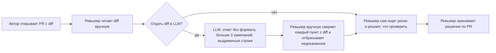
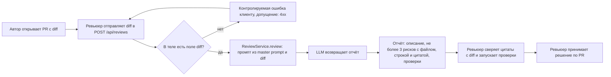

# Анализ процесса: AS IS и TO BE

Процесс: ревью diff одного PR для учебного кейса «AI-помощник ревьюера PR» (см. [`context.md`](context.md), [`problem.md`](problem.md)). Реальная команда неизвестна (допущение: кейс учебный), поэтому шаги AS IS описывают процесс, наблюдаемый в запуске P1-01, а не измеренный процесс команды.

## AS IS

Участники: автор PR, ревьюер, LLM (без требований к ответу).

Ручные операции и потери информации:

- Ревьюер читает diff целиком вручную; времени уходит много, риски пропускаются (с моих слов, замеров нет).
- При использовании LLM diff отдаётся без структуры и требований: ответ длинный, больше трёх замечаний, номера строк выдуманы, есть утверждения о том, чего в diff нет (P1-01: подтверждено 3 из 10 пунктов, ещё 1 принят как гипотеза).
- Ревьюер сам отделяет доказанное от выдуманного, сверяя каждый пункт с diff. Здесь теряется время и доверие к AI.
- Проверки (что запустить) ревьюер придумывает сам; в ответе LLM их нет.

## TO BE

Один процесс после изменения: ревьюер получает от помощника структурированный отчёт из трёх блоков и проверяет его по цитатам. Помощник только читает diff (`POST /api/reviews`, `ReviewService.review`) и не принимает решений. Решение по PR принимает человек.

Что здесь предложено, а не реализовано (по `TRAINING_PR.diff` сервис сейчас не делает этого): проверка поля `diff` с контролируемой ошибкой, обработка сбоя LLM, использование master prompt в качестве промпта `ReviewService`. Это допущения TO BE; выбор зафиксирован в [`adr.md`](adr.md).

## Разница

| Что меняется | AS IS | TO BE | Как проверим изменение |
|---|---|---|---|
| Формат ответа AI | Свободный текст, больше 3 замечаний, вопрос в конце (P1-01) | Три блока, не более 3 рисков (P1-02, Master Prompt v1.1) | Чек-лист формата на каждом запуске, метрика «доля ответов в формате» из `problem.md` |
| Доказательства | Строки выдуманы, часть утверждений не из diff | Файл, строка (или «не определяется») и цитата у каждого риска; гипотезы помечены | Ручная сверка с diff, метрики «доля рисков с доказательством» и «доля выдуманных фактов» |
| Проверки | Ревьюер придумывает сам | Конкретная команда или запрос у каждого риска | Ревьюер воспроизводит проверки; записывает «подтверждён/не подтверждён» в `prompts.md` |
| Решение по PR | Ревьюер | Ревьюер (без изменений); помощник не делает approve и merge | Проверка запретов в ответе; в API нет операций approve/merge (по diff их нет) |
| Ошибочный вход | `payload["diff"]` без поля даёт `KeyError` | Контролируемая ошибка (допущение: 4xx) | Тесты в [`tests_integration.md`](tests_integration.md) |
| Время ревью | Неизвестно | Снижение, величина не определена | Пилот на реальных PR (вне учебного кейса) |

## Как использовали AI

- Для чего: описать AS IS и TO BE по фактам P1-01, P1-02 и `TRAINING_PR.diff`, без выдуманных сведений о команде.
- Тип промпта: рабочий запрос агенту с контекстом из файлов практики.
- Строка в [`prompts.md`](prompts.md): строка 12 (P1-04); основание: строки 9 (P1-01) и 10 (P1-02).
- Что я проверил и какие исправления поручил: на момент записи я диаграммы не оценил; допущения помечены в тексте.
