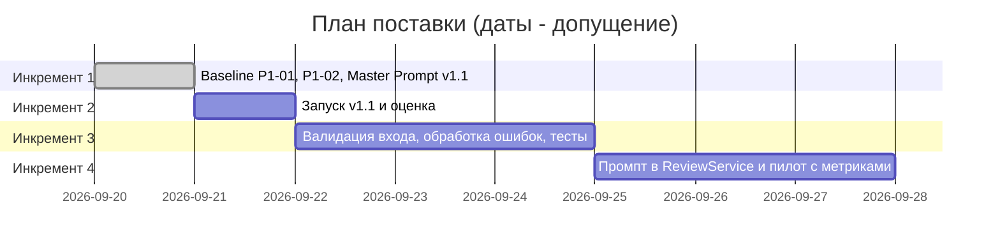

# План поставки

Все даты и оценки длительности ниже — допущения (реальный план и команда неизвестны, кейс учебный). Связь: [`analysis.md`](analysis.md), [`adr.md`](adr.md), тесты в `tests_*.md`.

## Роли

| Роль | Кто | Что делает |
|---|---|---|
| Владелец решения | Я | Ставит задачи, оценивает результаты, принимает или отклоняет; принимает ADR |
| Исполнитель | Claude Sonnet 5 Thinking | Ведёт файлы, запускает команды и `make`, записывает журнал; коммитит только по моей просьбе |
| Тестируемая модель | Claude Sonnet 5 Thinking в отдельных запусках без инструментов и истории чата | Выполняет ревью diff по инструкции (P1-01, P1-02, далее v1.1) |
| Ревьюеры курса | Преподаватели | Проверяют PR с материалами практики |

## Инкременты и ответственность

| Инкремент | Наблюдаемый результат | Что делает человек | Что делает AI | Проверка | Зависимости |
|---|---|---|---|---|---|
| 1. Baseline и master prompt | Два запуска (P1-01, P1-02), сравнение и Master Prompt v1.1 в `prompts.md` (сделано; запуск v1.1 записан как P1-05) | Оценивает ответы, формулирует замечания | Claude Sonnet 5 Thinking запускает отдельные запуски модели, сохраняет ответы, правит промпт | Сверка цитат и номеров строк с `TRAINING_PR.diff`; `make step1` | `TRAINING_PR.diff`, `context.md`, `problem.md` |
| 2. Проверка v1.1 | Запуск v1.1 на том же diff, запись строкой в журнал (P1-05, выполнено) и обновлённое сравнение | Оценивает ответ по чек-листу: тип факт/гипотеза, конкретные проверки, оговорка о hunk-счётчиках | Claude Sonnet 5 Thinking запускает тестируемую модель, тестируемая модель отвечает по v1.1 | Метрики из `problem.md`: доля рисков с доказательством, доля подтверждённых | Инкремент 1 |
| 3. Валидация входа и ошибок сервиса | Контролируемая ошибка вместо `KeyError` и при сбое LLM; unit и integration тесты проходят (запланировано, допущение) | Разработчик проверяет и принимает изменение кода | Claude Sonnet 5 Thinking пишет тесты по `tests_unit.md` и `tests_integration.md` (исходников сервиса в репозитории нет, вход — только diff) | Запуск тестов; сценарии `tests_e2e.md` | Доступ к коду сервиса (неизвестен, вопрос владельцу) |
| 4. Промпт помощника в сервисе и пилот | `ReviewService` использует master prompt; замер метрик на нескольких diff (запланировано, допущение) | Ревьюер отмечает «подтверждён/не подтверждён» | Помощник выдаёт отчёты; Claude Sonnet 5 Thinking считает метрики | Метрики `problem.md`; нагрузочные проверки `tests_load.md` при необходимости | Инкременты 2 и 3 |

Помощник в продукте не является исполнителем изменений: он только читает diff, а решения остаются за человеком (см. [`adr.md`](adr.md)).

## Диаграмма Ганта

## Как использовали AI

- Для чего: разложить работу на инкременты с ролями людей и AI и планом поставки.
- Тип промпта: рабочий запрос агенту с контекстом из файлов практики.
- Строка в [`prompts.md`](prompts.md): строка 12 (P1-04).
- Что я проверил и какие исправления поручил: на момент записи я план не оценил; даты и состав команды помечены допущениями.
